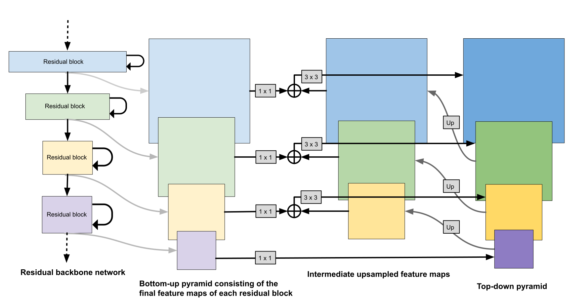

# Feature Pyramid Network
In this note we will explain how to implement the Feature Pyramid Network (FPN) component of the RetinaNet detection model. Quotes are from the [RetinaNet paper](https://arxiv.org/abs/1708.02002) except for those from the [FPN paper](https://arxiv.org/abs/1612.03144) which are marked as such.



Let us first implement a `RetinaNetFPNHead` class


```python
import tensorflow as tf
from typing import List, Iterable

class RetinaNetFPNHead(tf.keras.models.Model):
```


> As in [20] all pyramid levels have C = 256 channels


```python
    def __init__(self, filters: int=256):
        super(RetinaNetFPNHead, self).__init__()
```


> Details of the pyramid generally follow [20] with a few modest differences.


These are as follows:


> RetinaNet uses feature pyramid levels P3 to P7, where


> P3 to P5 are computed from the output of the corresponding ResNet residual stage (C3 through C5) using top-down and lateral connections just as in [20]


```python
        # self.block_P5 = tf.keras.layers.Conv2D(
        #     kernel_size=1,
        #     filters=filters,
        #     padding='same'
        # )

        self.block_P5 = FPNBlock(filters)
        self.block_P4 = FPNBlock(filters)
        self.block_P3 = FPNBlock(filters)

```


> P6 is obtained via a 3×3 stride-2 conv on C5


```python
        self.block_P6 = tf.keras.layers.Conv2D(
            kernel_size=3,
            filters=filters,
            strides=2,
            padding='same'
        )

```


> P7 is computed by applying ReLU followed by a 3×3 stride-2 conv on P6


```python
        self.block_P7 = tf.keras.models.Sequential(
            [
                tf.keras.layers.ReLU(),
                tf.keras.layers.Conv2D(
                    kernel_size=3,
                    filters=filters,
                    strides=2,
                    padding='same',
                    name='P7/conv'
                )
            ]
        )

        self.block_P3._init_set_name('P3')
        self.block_P4._init_set_name('P4')
        self.block_P5._init_set_name('P5')
        self.block_P6._init_set_name('P6')

    def call(self, inputs: List[tf.Tensor]) -> List[tf.Tensor]:
        C3, C4, C5 = inputs
        P6 = self.block_P6(C5)
        #P5 = self.block_P5(C5)
        P5 = self.block_P5(P6, C5)
        P4 = self.block_P4(P5, C4)
        P3 = self.block_P3(P4, C3)

        #P6 = self.block_P6(P5)
        P7 = self.block_P7(P6)

        return [P3, P4, P5, P6, P7]


```


For comparison, here is the original FPN head


```python
class FPNHead(tf.keras.models.Model):
    def __init__(self, filters: int):
        super(FPNHead, self).__init__()
```


> To start the iteration, we simply attach a $1 \times 1$ convolution layer on C5 to produce the coarsest resolution map


```python
        self.block_P5 = tf.keras.layers.Conv2D(
            kernel_size=1,
            filters=filters,
            padding='same'
        )
        self.block_P4 = FPNBlock(filters)
        self.block_P3 = FPNBlock(filters)
        self.block_P2 = FPNBlock(filters)

```


> Here we introduce P6 only for covering a larger anchor scale of $512^2$ P6 is simply a stride two subsampling of P5. P6 is not used by the Fast R-CNN detector in the next section.


```python
        self.block_P6 = tf.keras.layers.AveragePooling2D(pool_size=2, strides=2)

    def call(self, inputs: List[tf.Tensor]) -> List[tf.Tensor]:
        C2, C3, C4, C5 = inputs
        P5 = self.block_P5(C5)
        P4 = self.block_P4(P5, C4)
        P3 = self.block_P3(P4, C3)
        P2 = self.block_P2(P3, C2)

        P6 = self.block_P6(P5)

        return [P2, P3, P4, P5, P6]


```


Now we implement the building block of the FPN


```python
class FPNBlock(tf.keras.Model):
```


> [FPN Paper]<br>
> Because all levels of the pyramid use shared classifiers/regressors as in a traditional featurized image pyramid, we fix the feature dimension (numbers of channels, denoted as d) in all the feature maps. We set d = 256 in this paper and thus all extra convolutional layers have 256-channel outputs. There are no non-linearities in these extra layers, which we have empirically found to have minor impacts.


```python
    def __init__(self, filters: int=256):
        super(FPNBlock, self).__init__()
```


> [FPN Paper]<br>
> With a coarser-resolution feature map, we upsample the spatial resolution by a factor of 2 (using nearest neighbor upsampling for simplicity)


```python
        self.top_down_upsample = tf.keras.layers.UpSampling2D(
            size=2,
            data_format='channels_last',
            interpolation='nearest'
        )
```


> [FPN Paper]<br>
> The upsampled map is ... merged with the corresponding bottom-up map (which undergoes a 1×1 convolutional layer to reduce channel dimensions) by element-wise addition.


```python
        self.lateral_conv = tf.keras.layers.Conv2D(
            kernel_size=1,
            filters=filters,
            padding='same',
            name='lateral'
        )
        self.conv_out = tf.keras.layers.Conv2D(
            kernel_size=3,
            filters=filters,
            padding='same'
        )

    def call(self, top_down: tf.Tensor, bottom_up: tf.Tensor) -> tf.Tensor:
        x1 = self.top_down_upsample(top_down)
        x2 = self.lateral_conv(bottom_up)
        out = x1 + x2
        out = self.conv_out(out)
        return out
```
