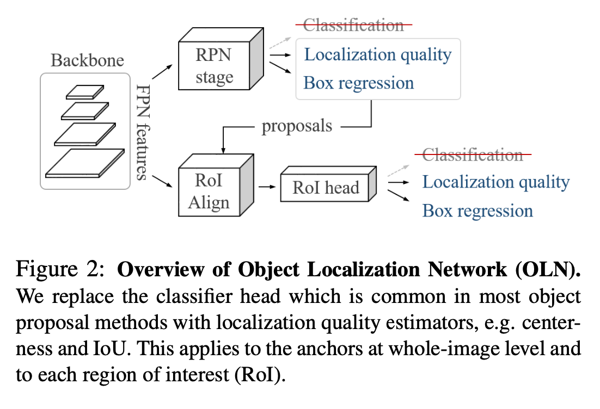
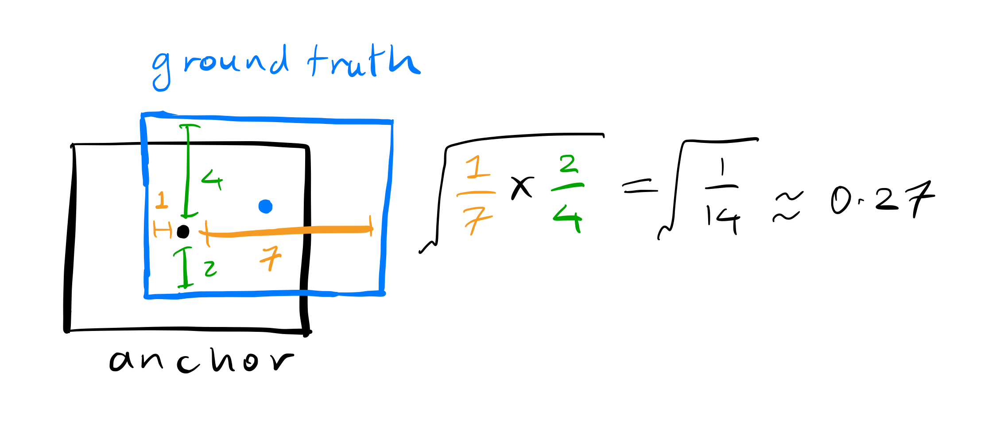

<style>
    .caption {
        font-size: 0.8em;
        color: #666;
        margin-top: 0.5em;
    }
</style>
# Object Localization Network

The classic Region Proposal Network found in the first stage of many detection models like FasterRCNN takes as input priors for regions of interest (RoIs) in the form of anchor boxes. It predicts whether each RoI is an object or not, and if so, it predicts the bounding box coordinates for the object. The objectness prediction is typically a binary classification, and the bounding box prediction is a regression problem.

Predicting if a region is an object or not is one way of determining the "objectness" of a region. However, it is not the only way. The  Object Localization Network (OLN) instead uses localisation targets to train the model to identify potential objects.


<p class="caption"
>Source: Learning Open-World Object Proposals without Learning to Classify (arXiv:2004.13362), Figure 2</p>

OLN is a "two-stage object proposer", not unlike a cascaded version of RPN, and it can be used in place of RPN in the first stage of a detection model. 

## OLN-RPN

The first stage comprises an objectness and a regression head. Here we will focus on the objectness head since the regression head is similar to that in the RPN.

The developers of the OLN state:

> We choose centerness [[56](https://arxiv.org/abs/1904.01355)] as the localization quality target 

Let us look at the centerness loss function in more detail. First note that anchors are assigned to target boxes and sampled as follows:

> For training the localization quality estimation branch, we randomly sample 256 anchors having an IoU larger than 0.3 with the matched ground-truth boxes, without any explicit background sampling

The targets are in the form `[top, bottom, left, right]`, and potentially normalised by the image size. Given the positive anchors `priors` and targets `gts` in form `[xmin, ymin, xmax, ymax]`, the target boxes are encoded as follows:

```python
prior_centers = (priors[:, 0:2] + priors[:, 2:4]) / 2
xmin, ymin, xmax, ymax = gts.split(1, dim=1)
top = prior_centers[:, 1].unsqueeze(1) - ymin
bottom = ymax - prior_centers[:, 1].unsqueeze(1)
left = prior_centers[:, 0].unsqueeze(1) - xmin
right = xmax - prior_centers[:, 0].unsqueeze(1)
loc = torch.cat((top, bottom, left, right), dim=1)
if normalize_by_wh:
    # Normalize tblr by anchor width and height
    wh = priors[:, 2:4] - priors[:, 0:2]
    w, h = torch.split(wh, 1, dim=1)
    loc[:, :2] /= h  # tb is normalized by h
    loc[:, 2:] /= w  # lr is normalized by w
```
<p class="caption">object_localization_network/mmdet/core/bbox/coder/tblr_bbox_coder.py</p>

Then objectness loss targets are computed as:

```python
top_bottom = pos_objectness_bbox_targets[:,0:2]
left_right = pos_objectness_bbox_targets[:,2:4]
pos_objectness_targets = torch.sqrt(
    (torch.min(top_bottom, -1)[0] / 
        (torch.max(top_bottom, -1)[0] + 1e-12)) *
    (torch.min(left_right, -1)[0] / 
        (torch.max(left_right, -1)[0] + 1e-12)))
```
<p class="caption">object_localization_network/mmdet/models/dense_heads/oln_rpn_head.py</p>

Note the target will be in the range `[0, 1]`. An example of a centerness target is shown below:



The L1 loss is used train the objectness head, after applying a sigmoid to the output since it needs to be in the range `[0, 1]`:

```python
loss_objectness = self.loss_objectness(
            objectness_score.sigmoid(), 
            objectness_targets, 
            objectness_weights, 
            avg_factor=num_total_samples)
```
<p class="caption">object_localization_network/mmdet/models/dense_heads/oln_rpn_head.py</p>

## OLN-Box

For the second stage

> We take the top-scoring (e.g., well-centered) proposals from OLN-RPN

This head also predicts objectness and bounding box coordinates. This time 

> We choose IoU as the localization quality target

## Inference
First you get the top-scoring proposals from the OLN-RPN and input them to the OLN-Box head. Then RoIAlign is used to crop the relevant portions of the feature map or maps (e.g. if you are using FPN) and pass them through the OLN-Box head. At this point we have two sets of scores, one for objectness from the OLN-RPN and one for objectness from the OLN-Box head. 

> During inference, the objectness score of a region $s$ is computed as a geometric mean of the centerness $c$ and IoU scores (box:$b$, mask:$m$) estimated by OLN-RPN and OLN-Box branches. For OLN-Box, the score $s = \sqrt{c·b}$

(They use a mask head for some experiments, hence the mask score $m$; see the paper for more details)

```python
# The objectness score of a region is computed as a geometric mean of
# the estimated localization quality scores of OLN-RPN and OLN-Box
# heads.
scores = torch.sqrt(rpn_score * bbox_score.sigmoid())
```
<p class="caption">object_localization_network/mmdet/models/roi_heads/bbox_heads/convfc_bbox_score_head.py</p>

Then NMS is applied to the scores to get the final predictions.

```python
# Concat dummy zero-scores for the background class.
scores = torch.cat([scores, torch.zeros_like(scores)], dim=-1)

if cfg is None:
    return bboxes, scores
else:
    det_bboxes, det_labels = multiclass_nms(bboxes, 
                                            scores,
                                            cfg.score_thr, cfg.nms,
                                            cfg.max_per_img)
```
<p class="caption">object_localization_network/mmdet/models/roi_heads/bbox_heads/convfc_bbox_score_head.py</p>

## References

All quotes are from [1] and all the code is from [3]. 
    
[1] [Learning Open-World Object Proposals without Learning to Classify3](https://arxiv.org/abs/2108.06753)

[2] [FCOS: Fully Convolutional One-Stage Object Detection](https://arxiv.org/abs/1904.01355)

[3] [Offical PyTorch implementation](https://github.com/mcahny/object_localization_network)